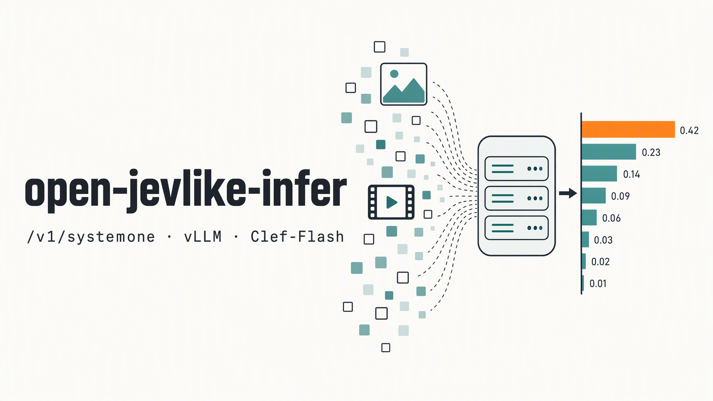

<div align="center">



# open-jevlike-infer

**开源 Jev 类决策模型的生产级推理服务**

兼容 Jev / SystemOne 的 `POST /v1/systemone` 接口。首个支持的模型是 Cloudflare 的 Clef-Flash，跑在 vLLM 上。

[](https://github.com/Arcobalneo/open-jevlike-infer/actions/workflows/ci.yml)
[](LICENSE)


[English](README.md) | 简体中文

</div>

决策模型读入一段状态（文本、JSON、图片、视频）和一组带类型的问题，一次前向计算就给出每个选项的概率，不生成文本。TypeSafe 的 Jev 定义了 `/v1/systemone` 接口，[Clef-Flash](https://huggingface.co/Cloudflare/clef-flash) 等开源模型也采用这套接口。这类模型带有自定义的打分头，只用 `vllm serve` 跑不起来。本项目用同一套接口提供这类模型的推理服务，速度快，可以直接上生产。

## 特性

- **兼容 Jev 接口**：支持 `choice`、`score`、`noul` 三类问题，沿用 Jev 的取值范围，支持图片和视频。为 Jev 写的客户端不用改。
- **vLLM 骨干加模型自带的决策头**：骨干以 vLLM pooling 模式运行，决策头在同一进程里读取 vLLM 输出的隐状态。并发请求自动合批。
- **与参考实现对齐**：逐 token 核对 vLLM 实际计算的输入和模型自身的编码；输出与 transformers 参考实现一致，概率分布最大差距 0.0067。
- **修复了上游代码的问题**：视频不再被压成 2 帧；vLLM 路径上的视频请求可以正常处理。
- **生产细节**：启动预热、统一的错误格式、可选 API Key、systemd 服务文件、Dockerfile，以及适配 CUDA 12 驱动的安装脚本。
- **测试完备**：CI 跑单元测试，另有 87 项端到端测试和可复现的基准脚本。

## 支持的模型

| 模型 | 后端 | 验证环境 | 文档 |
|---|---|---|---|
| [Cloudflare/clef-flash](https://huggingface.co/Cloudflare/clef-flash)（9B，多模态） | `vllm`（默认）、`hf` | A800 80GB，驱动 550 | [docs/models/clef-flash.md](docs/models/clef-flash.md) |

后续会支持更多开源 Jev 类模型。欢迎[提需求](https://github.com/Arcobalneo/open-jevlike-infer/issues/new?template=model_request.yml)或[自己接入](docs/adding-a-model.md)。

## 性能

单张 A800-SXM4-80GB 上的 Clef-Flash（[完整结果和测试条件](benchmarks/results/clef-flash-a800.md)）：

| | 参考实现（transformers） | **open-jevlike-infer（vLLM）** |
|---|---|---|
| 短请求（291 token）中位延迟 | 60 毫秒 | **45 毫秒** |
| 512×512 图片请求中位延迟 | 177 毫秒 | **75 毫秒** |
| 16 并发吞吐 | 每秒 15 个 | **每秒 28 个** |
| ARC-Challenge / ARC-Easy | | **98.6 / 99.6**（模型卡：98.3 / 99.5） |

参考实现一列已经装好线性注意力的快速路径；不装的话，短请求约 160 毫秒。

## 快速开始

环境要求：Linux，Python 3.10 及以上，NVIDIA 显卡且驱动支持 CUDA 12 或更高版本。已在 80 GB 的 A800 上验证；bf16 权重约占 19 GB 显存。

```bash
git clone https://github.com/Arcobalneo/open-jevlike-infer.git && cd open-jevlike-infer

# 1. 安装。NVIDIA 驱动 580 及以上（CUDA 13）：
pip install -e ".[vllm]"
#    驱动 525 到 579（CUDA 12）：把 CUDA 12.9 版的 vLLM 和 torch 装进 .venv
pip install uv && scripts/install_cuda12.sh .venv && source .venv/bin/activate

# 2. 下载权重（约 19 GB，自动校验 sha256）
python scripts/download_model.py --model clef-flash --dir ./models/clef-flash

# 3. 启动服务（加载加预热约 100 秒）
jevlike-infer serve --model clef-flash --model-path ./models/clef-flash --port 8000
```

发一个请求：

```bash
curl -s http://127.0.0.1:8000/v1/systemone -H 'content-type: application/json' -d '{
  "model": "clef-flash",
  "state": "我的订单三天还没发货，怎么回事？",
  "questions": {
    "intent": {"type": "choice", "criteria": {"logistics": "物流/发货", "refund": "退款", "other": "其他"}},
    "angry":  {"type": "score",  "criteria": ["平静", "不满", "愤怒"]},
    "urgent": {"type": "noul",   "instructions": "需要今天回复吗？"}
  }
}'
```

返回中 `intent` 选 `logistics`（概率 0.976），`angry` 的期望分 0.92（接近“不满”），每个选项都带概率。图片和视频放在 `images` / `videos` 里，可以用 data URI、base64、网址，视频还可以传一组帧图片。详见 [API 文档](docs/api.md)（英文）和 [examples/](examples/)。

## 部署

- **systemd**：[deploy/systemd/jevlike-infer.service](deploy/systemd/jevlike-infer.service)
- **Docker**：[deploy/docker/Dockerfile](deploy/docker/Dockerfile)（CUDA 12.9 构建，驱动 525 及以上）和 [compose.yaml](deploy/docker/compose.yaml)

所有配置都可以用命令行参数或 `JEVLIKE_*` 环境变量设置（见 `jevlike-infer serve --help`）：

| 配置 | 默认值 | 说明 |
|---|---|---|
| `--model` / `JEVLIKE_MODEL` | `clef-flash` | 要加载的模型 |
| `--model-path` / `JEVLIKE_MODEL_PATH` | 必填 | 本地模型目录 |
| `--backend` / `JEVLIKE_BACKEND` | `vllm` | `vllm` 或 `hf` |
| `--port` / `JEVLIKE_PORT` | `8000` | 端口 |
| `--api-key` / `JEVLIKE_API_KEY` | 无 | 设置后调用须携带 `Authorization: Bearer <key>` |
| `--gpu-memory-utilization` | `0.5` | vLLM 可用的显存比例 |
| `--max-batch` / `--batch-window-ms` | `32` / `2` | 合批的最大条数和最长等待时间 |
| `--no-media-urls` | 关 | 拒绝网址形式的媒体，只收内联数据 |
| `--max-media-items` / `--max-media-bytes` | `16` / 50 MB | 单个请求的媒体数量和大小上限 |

## 原理

```
请求 ─► 按 Jev 规则校验 ─► 解码图片视频 ─► 合批 ─► vLLM 骨干（pooling）
     ◄─ answers 和 usage ◄─── 决策头读取隐状态 ◄────────────┘
```

先用模型自带的编码器确定每个问题和选项在 token 序列中的位置。媒体占位符折叠后交给 vLLM 重新展开；vLLM 运行骨干，返回每个 token 的隐状态；服务逐 token 核对 vLLM 的输入和模型自身的编码；最后由模型自带的决策头给各选项打分。详见 [docs/architecture.md](docs/architecture.md)（英文）。

## 与现有方案对比

| | `vllm serve` | Clef 官方参考代码 | [clef-NVFP4](https://huggingface.co/simonlehmann/clef-NVFP4) 的 `clef_vllm.py` | **open-jevlike-infer** |
|---|---|---|---|---|
| 运行决策头 | 否 | 是 | 是 | 是 |
| 模型 | - | Clef-Flash bf16 | Clef 27B NVFP4（仅 Blackwell） | Clef-Flash bf16（已在 A800 上验证） |
| HTTP `/v1/systemone` 服务 | - | 无 | 无 | 有 |
| 跨请求合批 | - | 无 | 无 | 有 |
| 视频 | - | 被压成 2 帧 | 在 vLLM 上报错 | 正确 |
| 测试和基准 | - | 无 | 有量化偏差报告 | 单元测试、端到端测试、基准脚本 |

## 测试

```bash
pip install -e ".[dev]" && pytest                               # 单元测试，不需要 GPU
python tests/e2e/run_e2e.py --base-url http://127.0.0.1:8000    # 对运行中的服务跑 87 项检查
# 服务跑在 Docker 里时加 --fixture-host 172.17.0.1，容器才能取到测试用的图片和视频
```

基准脚本见 [benchmarks/](benchmarks/README.md)。

## 参与贡献

欢迎提 issue 和 PR，尤其欢迎接入新模型、补充其他显卡上的测试结果。见 [CONTRIBUTING.md](CONTRIBUTING.md)。

## 致谢

- [Cloudflare](https://blog.cloudflare.com/clef-decision-models/) 以 Apache-2.0 协议开源 Clef 和 Clef-Flash。
- [simonlehmann/clef-NVFP4](https://huggingface.co/simonlehmann/clef-NVFP4) 提供了本项目所基于的 vLLM pooling 思路。
- [vLLM](https://github.com/vllm-project/vllm)。
- TypeSafe AI 设计了 Jev / SystemOne 接口。

本项目为独立项目，与 Cloudflare、TypeSafe AI 无隶属关系。

## 许可证

[Apache-2.0](LICENSE)。模型权重从各自的仓库下载，遵循各自的许可证，见 [NOTICE](NOTICE)。
