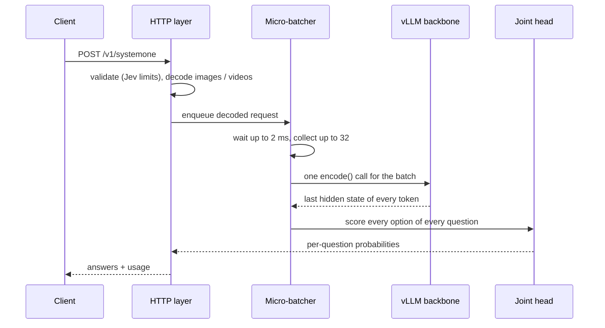

# Architecture

## Layers

The code is split by what depends on the model.

| Module | Model-specific | Role |
|---|---|---|
| `api/schema.py` | no | Jev request validation and limits |
| `api/server.py` | no | FastAPI app, auth, error mapping, request log |
| `media.py` | no | Image / video decoding, video metadata |
| `batching.py` | no | Dynamic micro-batching across concurrent requests |
| `models/base.py` | no | `DecisionModel` interface: `decide(request)`, `warmup()` |
| `models/__init__.py` | no | Registry of model name to module |
| `models/clef_flash/` | yes | Clef-Flash on vLLM (production) and on transformers (reference) |

A request reaches the model already validated, with `images` as RGB PIL images and `videos` as
`Video(frames, metadata)`. The model returns the SystemOne response body. Adding a model means adding
one package under `models/`; see [adding-a-model.md](adding-a-model.md).

## Clef-Flash on vLLM

Clef-Flash is a Qwen3.5-9B multimodal backbone plus a *joint schema head*: a small transformer that
reads the backbone's last hidden states at the spans of each question and option, routes evidence
between them and emits one logit per option. Nothing is generated, so `vllm serve` alone is not
enough: it would run the backbone and never the head.

The vLLM backend runs the backbone with `runner="pooling"` and token-level pooling (`ALL`), which
returns the last hidden state of every input token, then runs the release's own head on top in the
same process. Steps per batch:

1. **Encode** each request with the release's `encode_record` (the HF processor expands media
   placeholders). This fixes Clef's token positions for every question and option.
2. **Collapse media placeholders** back to one per image / video, because vLLM expands them again
   from the media itself (`tokens.py`). For Qwen3-VL videos this means removing the per-frame-group
   timestamps and nested vision markers too.
3. **Encode the batch in vLLM** with the same media and video metadata, so vLLM's expansion
   reproduces Clef's sequence.
4. **Verify** that the token sequence vLLM ran equals Clef's encoding token for token. The head
   indexes hidden states by position; a sequence of the right length but different content would give
   silently wrong answers, so a mismatch fails the request instead.
5. **Run the joint head** per request and convert logits to SystemOne answers with the release's
   `systemone_answer`.

`lm_head` is loaded separately: the head uses its rows as option embeddings, and a vLLM pooling model
does not load it.

If one request in a batch makes `encode()` fail, the batch is retried one request at a time so the
others still succeed.

## Where the time goes

At batch 32 of short requests (~290 tokens) on an A800 (`benchmarks/profile_clef_flash.py`):

| Stage | Per request |
|---|---|
| CPU encoding (tokenizer, processor) | ~2 ms |
| vLLM backbone, including copying every token's hidden state out of vLLM | ~19 ms |
| Joint head | ~7 ms |

Two costs dominate at high concurrency. The pooling runner hands back the hidden state of every
token, which the head needs but which has to leave vLLM; and the release's head processes records one
at a time. Both are candidates for future work; the second needs changes to Cloudflare's model code.
